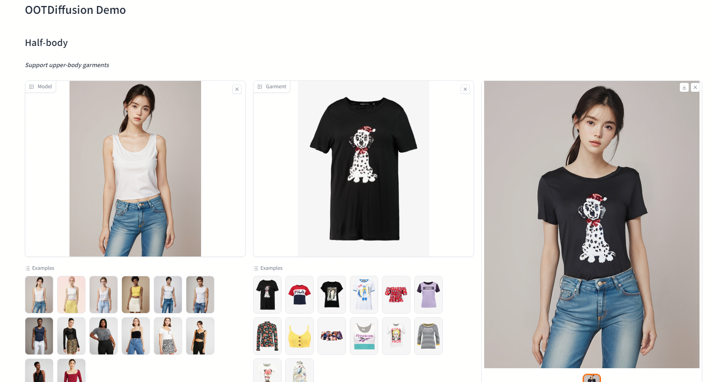

# OOTDiffusion

Extension for [webui](https://github.com/AUTOMATIC1111/stable-diffusion-webui). 

Find the UI for Vitrual Try-on in the Extras tab after installing the extension.

# Installation

Install from webui's Extensions tab.

# Credits

* OOTDiffusion that does all the work: https://github.com/levihsu/OOTDiffusion
